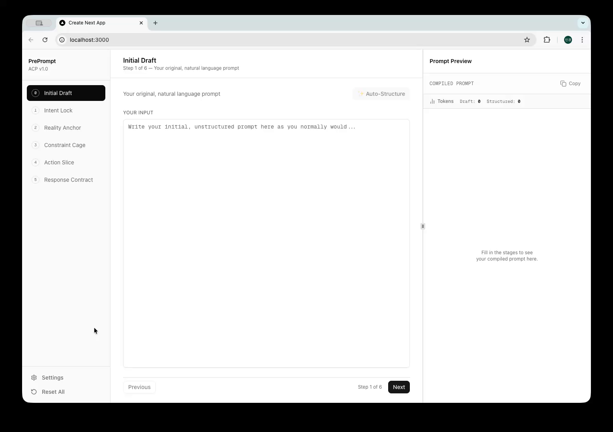
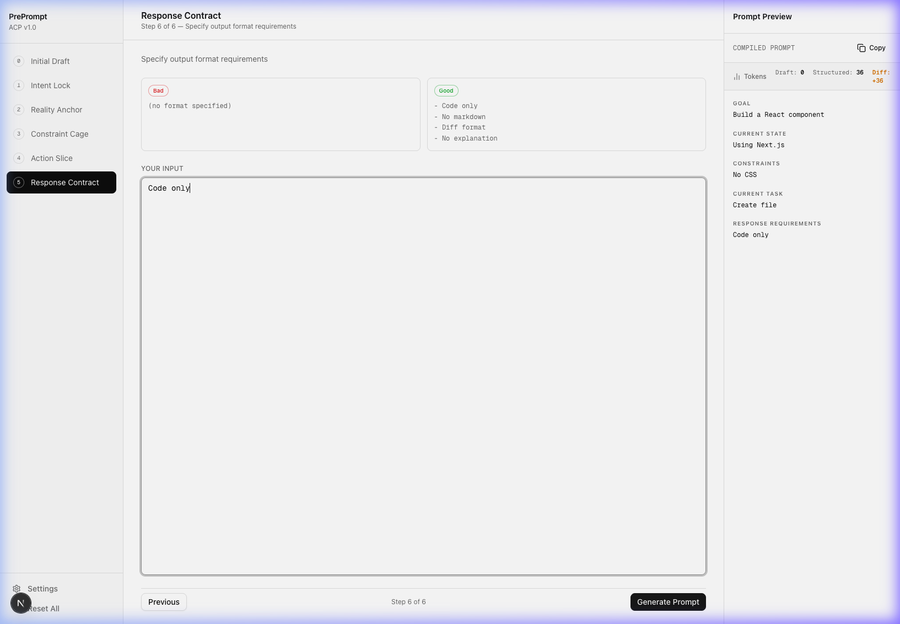

# PrePrompt

[**Live Demo: pre-prompt.vercel.app**](https://pre-prompt.vercel.app/)

**PrePrompt** is a Pre-AI Cognitive Layer—a structured thinking protocol you pass through *before* sending a request to an AI system. It is designed to reduce token usage, prevent AI over-generation, and give you back control over your AI outputs.

## 🔒 Privacy & Token Security

All tokens and inputs you enter are processed locally. **We do not store your API tokens or prompt data anywhere**, so you do not need to worry about security leaks. However, because there is no remote saving feature, **you may need to re-enter your tokens each time you use the app or clear your browser data.**

## 🌟 The AI Collaboration Protocol

This application guides you through five mandatory thinking stages to construct an optimal prompt:

1. **Intent Lock**: Clearly define the desired end-state.
2. **Reality Anchor**: Explicitly describe the current system state.
3. **Constraint Cage**: Define non-negotiable boundaries.
4. **Action Slice**: Reduce the task to the smallest meaningful execution unit.
5. **Response Contract**: Specify output format requirements.

## 📸 Screencast & Screenshots

### Usage Demo

Here is a quick walkthrough of filling out the 5-stage UI to generate a structured prompt.



### Compiled Prompt Preview

Your inputs are automatically compiled into a clean, structured prompt ready for Cursor, Claude, or ChatGPT.



## 🚀 Tech Stack

- **Framework**: Next.js 14 (App Router)
- **Styling**: Tailwind CSS & shadcn/ui
- **State Management**: Zustand
- **Language**: TypeScript

## 📦 Getting Started

1. Clone the repository
2. Install dependencies:

   ```bash
   npm install
   ```

3. Run the development server:

   ```bash
   npm run dev
   ```

4. Open [http://localhost:3000](http://localhost:3000) with your browser to see the result.

## 🔬 Motivation & Research

Modern LLM-based development tools provide powerful generation capabilities but often lead to scoping drift and repetition. PrePrompt acts as an experimental proof-of-concept for:

- Human-AI interface design.
- Structured cognition before LLM interaction.
- Token-efficient collaboration models.
